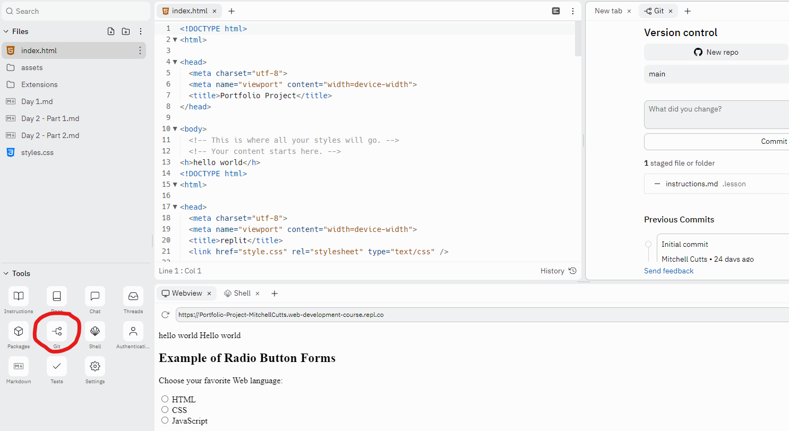
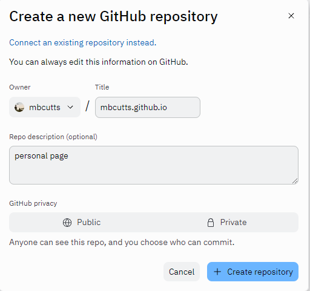
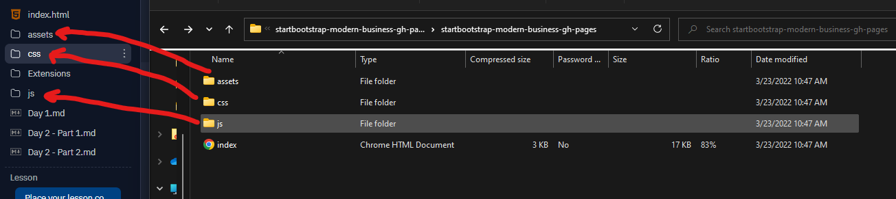
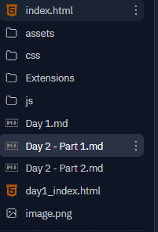

## Portfolio Site Day 2 - Part 1 
###### Author(s):  R. Tang, S. Dave, M. Cutts

# Objectives
- Get your site started on Github.
- Learn how to use bootstrap templates to fast-track professional website development.
- Learn how to alter the font, color, size, and change of the spacing/alignment of various elements. 

# Lesson

An important tool in any developers arsenal is [github](https://github.com). Later today, we are going to put our webpages live on the web using github pages, and github is going to be the main place we will store our code. 

1. Our first task is to create a github account if you haven't yet. You can do so on [github.com](https://github.com).
2. Once you've set up an account you can click the "fork" or "git" option on your sidebar of your replit IDE. once the window opens, you'll want to sign in and select "New Repo". 
3. When creating a new repo, you need to save it in the following format. Your repo title should be your "username".github.io. In the below example, my username is mbcutts, so I titled the repo mbcutts.github.io. You should give the project a description and select "public" for privacy settings!

4. Now, in the git window, select "Commit All & Push". You're good to go now!

> **Note**: This portion is extremely important so be sure you followed along carefully. 

_____

### Stylizing

To kickstart the stylization of our project, we are going to use [startbootstrap.com](https://startbootstrap.com/templates?showPro=false&showVue=false&showAngular=false). StartBootstrap has several free bootstrap templates and themes.

1. With your team, follow the link above and select a template that would roughly match the structure of your website. You will learn how to customize every aspect of your page, but starting off with base working code will help you greatly!
> **!!!! We recommend that everyone on your team chooses the same templates to promote simplicity when you merge your webpages.**
2. Click on the template of your choice, confirm it is a good match for your page and click on the "Free Download" button once you are on your template page! A zip should start downloading.
3. Once your zip downloads, simply unzip it and begin copying the files to their corresponding folders. **DO NOT copy `index.html` yet. 
4. Rename the `index.html` file you in your currenty folder to something like `day1_index.html`. Then, upload the bootstrap `index.html` to the project! Your files and folders should look something like this:

5. Now, you can start to mix and match! You should take your content from your `day1_index.html` file (that you created yesterday), and populating the new `index.html` that is bootstrap designed. You can make this project your own -- remove and add features as necessary.

A couple of recommendations for you:
- If you want something specific like a dropdown, video header, contact form, logo navbar, or more features in that category, we recommend checking out [bootstrap snippets](https://startbootstrap.com/snippets).
  
## Enjoy your lunch break everyone! See you for Part Two.
After lunch we will be discussing more ways we can customize our webpages!

