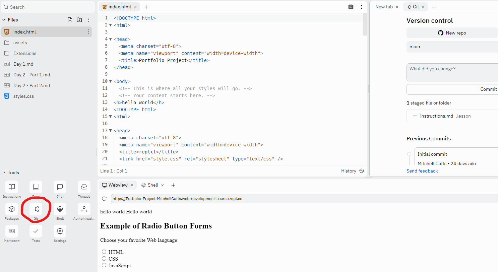

# Portfolio Site Day 2 - Part 2
###### Authors: R. Tang, M. Cutts
Welcome back from Lunch Break! Before lunch you should have used a bootstrap template to beautify your site. From here, we are going to beautify your site and deploy it to the web using github pages. 

### Objectives
- Learn how to add custom Bootstrap to your front-end development
- Get your site live on the Web!

#### Preview


Cool right? You're gonna learn how to build these!

## Lesson
- You got some basic experience with bootstrap templates before the lunch break.
- Now, we're learning a CSS Framework called `Bootstrap CSS`.
> CSS Framework: Some code that other people wrote so that you don't have to write CSS from scratch and can simply use classes. 
>
> Official definition:  "a combination of design best-practices and standardized class systems that provide a basic structure for styling a web page."

Turns out, Bootstrap is very convenient and provides lots of styling that you would need to write thousands of lines of code for otherwise. If you're interested in learning how to write that code however, we have extensions you can check out for CSS and bootstrap!

_____

To give you a small appetizer, here is some of the stuff you can do with Bootstrap:   


#### Accordion Collapsing Text

#### Dynamic NavBar

#### Info Popup


_____
Alright.

Consider this: You're making a product presentation website and you want 3 vertical calumns to put text in describing your product specs. You're going for something that looks like this:


_____
* To do this in HTML and CSS, you would need write the following code:

HTML File:
```html
<div class="row">
  <div class="column"></div>
  <div class="column"></div>
  <div class="column"></div>
</div>
```
CSS File:
```css
.column {
  float: left;
  width: 33.33%;
}

/* Clear floats after the columns */
.row:after {
  content: "";
  display: table;
  clear: both;
}

```

____ 
Although this gives us the desired result, it's inneficient and takes a lot of effort to change the horizontal alignment. And this code may not provide the right result if we only need two columns or need more columns that 3. 
* However, with Bootstrap , your files would look like this:

```html
<div class="container text-center">
  <div class="row align-items-start">
    <div class="col">
      One of three columns
    </div>
    <div class="col">
      One of three columns
    </div>
    <div class="col">
      One of three columns
    </div>
  </div>
```
_____

* All of the CSS is already written for you which saves a lot of time.
* Manually changing the number of colums or the horizontal alignment is very easy as well:


```html
  <!-- moving all columns to the right -->
  <div class="row justify-content-end">
    <div class="col-4">
      One of two columns
    </div>
    <div class="col-4">
      One of two columns
    </div>
  </div>


  <!-- leaves a space in the center of the columns -->
  <div class="row justify-content-around">
    <div class="col-4">
      One of two columns
    </div>
    <div class="col-4">
      One of two columns
    </div>
  </div>


  <!-- adds a bigger space where you can put stuff between -->
  <div class="row justify-content-between">
    <div class="col-4">
      One of two columns
    </div>
    <div class="col-4">
      One of two columns
    </div>
  </div>

  ```
_____
  This is what the result from the above code would somewhat look like:


_____

This website has a lot of bootstrap features (kinda like a dictionary for bootstrap). Use the left navbar on this website for research and reference:

[https://getbootstrap.com/docs/5.2/components/accordion/](https://getbootstrap.com/docs/5.2/components/accordion/).


1. Research some Bootstrap and use it in your website! There's a lot more to bootstrap than just making it easier to make columns.
>You don't HAVE to include the example columns in your website, but you are totally ALLOWED to copy/paste it!
2. If you are feeling uninspired, scroll down to the bottom of this document and try some of the selections we have put together for you beforehand!
_____ 
### Get your webpage out there!

At this point, you should be completely done with the very first version of your website. Let's get this bad boy on the web!

1. Get together with your team and do a quick overview of your final project pages. Make sure all the content fits together well, and remember you'll still have 3 days to correct any issues. 

2. Once you and your team are ready to launch your pages, you're going to **push your code to github**. Remember that your repo must be ***username***.github.io, where ***username*** is your github username!




3. Follow these [deployment slides](https://www.canva.com/design/DAFAfdLnhvY/pjt3KkphA7N4wvZhgz9g0A/edit?utm_content=DAFAfdLnhvY&utm_campaign=designshare&utm_medium=link2&utm_source=sharebutton) for a tutorial on how to get your site live on the web. We have included some more resources below for you to learn this part -- remember to ask your instructor if you have any  questions!

- [Github Pages Tutorial](https://pages.github.com/): Follow instructions for user/organization site. 
- [YouTube Search](https://www.youtube.com/results?search_query=github+pages+tutorial)


_____
### Bootstrap Code Snippets to Try!


### Select Menu

```html
<select class="form-select" aria-label="Default select example">
  <option selected>Open this select menu</option>
  <option value="1">One</option>
  <option value="2">Two</option>
  <option value="3">Three</option>
</select>


```
Result:


### Accordion Text

```html

<div class="accordion" id="accordionExample">
  <div class="accordion-item">
    <h2 class="accordion-header" id="headingOne">
      <button class="accordion-button" type="button" data-bs-toggle="collapse" data-bs-target="#collapseOne" aria-expanded="true" aria-controls="collapseOne">
        Accordion Item #1
      </button>
    </h2>
    <div id="collapseOne" class="accordion-collapse collapse show" aria-labelledby="headingOne" data-bs-parent="#accordionExample">
      <div class="accordion-body">
        <strong>This is the first item's accordion body.</strong>
      </div>
    </div>
  </div>
  <div class="accordion-item">
    <h2 class="accordion-header" id="headingTwo">
      <button class="accordion-button collapsed" type="button" data-bs-toggle="collapse" data-bs-target="#collapseTwo" aria-expanded="false" aria-controls="collapseTwo">
        Accordion Item #2
      </button>
    </h2>
    <div id="collapseTwo" class="accordion-collapse collapse" aria-labelledby="headingTwo" data-bs-parent="#accordionExample">
      <div class="accordion-body">
        <strong>This is the second item's accordion body.</strong> 
      </div>
    </div>
  </div>
  <div class="accordion-item">
    <h2 class="accordion-header" id="headingThree">
      <button class="accordion-button collapsed" type="button" data-bs-toggle="collapse" data-bs-target="#collapseThree" aria-expanded="false" aria-controls="collapseThree">
        Accordion Item #3
      </button>
    </h2>
    <div id="collapseThree" class="accordion-collapse collapse" aria-labelledby="headingThree" data-bs-parent="#accordionExample">
      <div class="accordion-body">
        <strong>This is the third item's accordion body.</strong> 
      </div>
    </div>
  </div>
</div>
```

______
Result:


